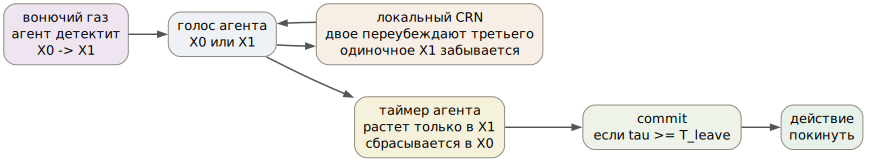
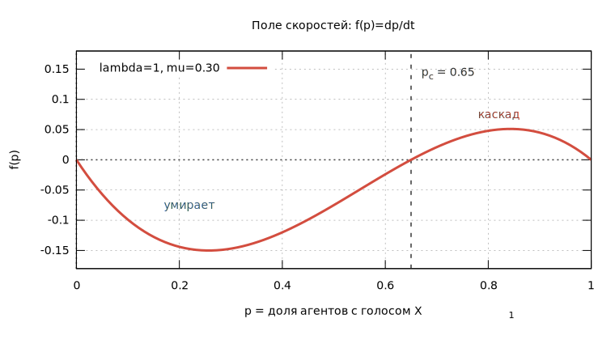
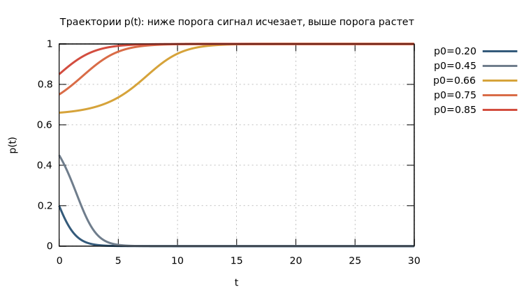
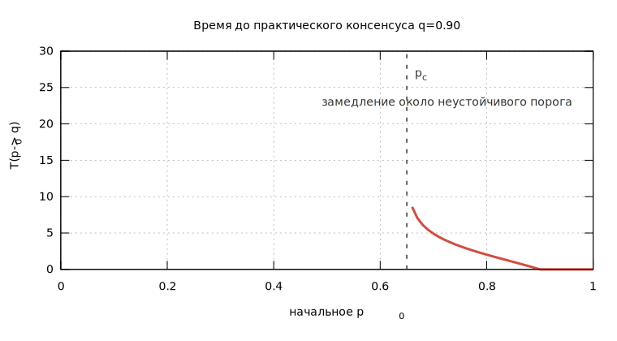

# Аннотация

Мы описываем простую модель эвакуационного поведения без центра управления.
В популяции есть только агенты, каждый из которых хранит бинарный внутренний
голос:

$$
X_0 = \text{остаться / ничего не делать}, \qquad
X_1 = \text{уйти / действовать}.
$$

Опасность кратковременно переводит часть агентов из $X_0$ в $X_1$: агент
детектит вонючий газ и решает уходить. Дальше решение распространяется или
исчезает через локальный популяционный протокол: локальное большинство
переубеждает меньшинство, а одиночное намерение уйти забывается. Главная
математическая модель является химической реакционной сетью (CRN):

$$
2X_0 + X_1 \longrightarrow 3X_0,
\qquad
2X_1 + X_0 \longrightarrow 3X_1,
\qquad
X_1 + X_0 \longrightarrow 2X_0.
$$

Из закона сохранения общей массы $x_0+x_1=1$ система сводится к одномерному
уравнению для доли агентов с голосом $X_1$:

$$
\dot p
=
p(1-p)\left[\lambda(2p-1)-\mu\right].
$$

Это уравнение имеет две устойчивые крайние точки: все остаются и все уходят.
Между ними находится неустойчивый порог $p_c$. Если начальная доля агентов,
решивших уйти, ниже порога, она затухает; если выше порога, консенсус к уходу
является аттрактором.
Индивидуальный таймер не создает консенсус, а только обнаруживает, что агент
достаточно долго не был переубежден вернуться в $X_0$.

{width=85%}

# 1. Что мы моделируем

Нас интересует не физика движения толпы, а более маленький вопрос:

> как группа без лидера, без общей памяти и без глобального голосования может
> перейти от бездействия к массовому уходу?

У каждого агента есть только внутреннее состояние $X_0$ или $X_1$. Агент не
читает глобальную долю голосов, не знает, что решила комната, и не получает
команду от внешнего контроллера. Он меняет голос только из-за двух механизмов:

1. локальный внешний толчок: агент детектит вонючий газ и переходит в $X_1$;
2. локальные взаимодействия с другими агентами.

В браузерной демонстрации есть комнаты, двери, вонючий газ и движение. В этой статье
это не часть математической модели. Геометрия нужна, чтобы сделать протокол
видимым и интерактивным. Научное ядро модели -- CRN, ее одномерная редукция и
индивидуальный таймер.

# 2. Реакционная сеть

Пусть $X_0$ означает инерцию, а $X_1$ -- намерение уйти. Базовое правило:
локальная тройка принимает большинство.

Если два агента хотят остаться, а один хочет уйти, то они переубеждают его
остаться:

$$
2X_0 + X_1 \xrightarrow{\lambda} 3X_0.
$$

Если два агента хотят уйти, а один хочет остаться, то они переубеждают его
уйти с ними:

$$
2X_1 + X_0 \xrightarrow{\lambda} 3X_1.
$$

Чтобы поведение было не просто симметричным голосованием, а имело инерцию к
бездействию, добавим забывание:

$$
X_1 + X_0 \xrightarrow{\mu} 2X_0.
$$

Смысл последней реакции простой: одиночное намерение уйти рядом с инертным
агентом склонно исчезать. В реальной системе это может означать сомнение,
нормализацию запаха, социальное давление "не суетиться" или обычную потерю
внимания.

Вонючий газ можно моделировать как внешний временный вход:

$$
X_0 \longrightarrow X_1.
$$

Но для анализа порога нам достаточно рассмотреть, что часть агентов уже
почувствовала газ и перешла в состояние $X_1$. То есть вход создал начальную
долю $p_0$. Дальше вопрос такой: $p_0$ исчезнет или вырастет до консенсуса?

# 3. Закон сохранения и одномерная редукция

Обозначим концентрации или доли агентов:

$$
x_0(t) = [X_0], \qquad x_1(t) = [X_1].
$$

Реакции только переводят агентов между двумя состояниями. Они не создают и не
уничтожают агентов. Поэтому общая масса сохраняется:

$$
x_0 + x_1 = 1.
$$

Введем одну переменную:

$$
p = x_1.
$$

Тогда:

$$
x_0 = 1-p.
$$

Это главный шаг упрощения. Вместо двух переменных $x_0,x_1$ нам нужна только
одна: доля популяции, находящаяся в состоянии действия.

# 4. Массовое действие и ODE

Теперь выпишем вклад каждой реакции в $\dot p$.

Реакция

$$
2X_1 + X_0 \to 3X_1
$$

увеличивает число $X_1$ на единицу. По закону массового действия ее скорость
пропорциональна $x_1^2x_0$. Значит, положительный вклад:

$$
+\lambda x_1^2x_0.
$$

Реакция

$$
2X_0 + X_1 \to 3X_0
$$

уменьшает число $X_1$ на единицу. Ее скорость пропорциональна $x_0^2x_1$.
Отрицательный вклад:

$$
-\lambda x_0^2x_1.
$$

Забывание

$$
X_1 + X_0 \to 2X_0
$$

тоже уменьшает число $X_1$ на единицу. Его вклад:

$$
-\mu x_1x_0.
$$

Складываем:

$$
\dot x_1
=
\lambda x_1^2x_0
-
\lambda x_0^2x_1
-
\mu x_1x_0.
$$

Подставляем $x_1=p$, $x_0=1-p$:

$$
\dot p
=
\lambda p^2(1-p)
-
\lambda(1-p)^2p
-
\mu p(1-p).
$$

Выносим общий множитель $p(1-p)$:

$$
\dot p
=
p(1-p)\left[\lambda p-\lambda(1-p)-\mu\right].
$$

Упрощаем скобку:

$$
\lambda p-\lambda(1-p)-\mu
=
\lambda(2p-1)-\mu.
$$

И получаем одномерную систему:

$$
\boxed{
\dot p
=
p(1-p)\left[\lambda(2p-1)-\mu\right].
}
$$

Это уравнение -- не симулятор. Это mean-field линза. Оно показывает, где
находится порог: когда одиночные намерения уйти исчезают, а когда агенты,
решившие уйти, начинают переубеждать остальных.

# 5. Фиксированные точки и фазовая прямая

Обозначим:

$$
f(p) = p(1-p)\left[\lambda(2p-1)-\mu\right].
$$

Фиксированные точки находятся из $f(p)=0$.

Первые две очевидны:

$$
p=0,
\qquad
p=1.
$$

Третья возникает из скобки:

$$
\lambda(2p-1)-\mu = 0.
$$

Отсюда:

$$
2p-1 = \frac{\mu}{\lambda},
$$

и значит:

$$
\boxed{
p_c
=
\frac{1}{2}\left(1+\frac{\mu}{\lambda}\right).
}
$$

Если $0<\mu<\lambda$, то $p_c$ лежит внутри интервала $(0,1)$.
Знаки $f(p)$ дают фазовую картину:

$$
0 < p < p_c
\quad\Rightarrow\quad
\dot p < 0,
$$

$$
p_c < p < 1
\quad\Rightarrow\quad
\dot p > 0.
$$

Следовательно:

* $p=0$ устойчиво: все вернулись к бездействию;
* $p=p_c$ неустойчиво: это порог;
* $p=1$ устойчиво: консенсус к уходу является аттрактором.

Важно, что нахождение около порога не является провалом модели. Содержательно
это валидное состояние нерешительности. Если популяция не смогла произвести
устойчивый консенсус к уходу, то практическое решение системы -- остаться. В
этом смысле отсутствие консенсуса не требует отдельного третьего состояния:
нерешительность реализуется как возврат к $X_0$.

В непрерывной mean-field картине точка $p_c$ является точно сбалансированным
неустойчивым состоянием. В конечной стохастической популяции точное
балансирование почти не сохраняется: флуктуации и новые локальные встречи
сдвигают систему либо к $0$, либо к $1$. Если же система долго остается близко к
порогу, это как раз означает, что достаточного коллективного убеждения уйти не
возникло.

{width=92%}

Если $\mu \ge \lambda$, то:

$$
p_c \ge 1.
$$

Тогда внутреннего порога уже нет: забывание настолько сильно, что консенсус к
уходу не достигается из обычного внутреннего начального состояния. Практически:
система слишком склонна возвращать агентов к бездействию.

# 6. Что делает таймер

Сам голос $X_1$ еще не означает действие. Иначе случайная флуктуация могла бы
сразу вызвать выход. Поэтому у каждого агента есть индивидуальный таймер
$\tau_i$.

В простейшей версии:

$$
\dot \tau_i =
\begin{cases}
1, & v_i = X_1,\\
0, & v_i = X_0 \text{ и таймер сброшен}.
\end{cases}
$$

При сбросе:

$$
v_i = X_0
\quad\Rightarrow\quad
\tau_i = 0.
$$

Более мягкая версия:

$$
\dot \tau_i =
\begin{cases}
1, & v_i = X_1,\\
-\rho \tau_i, & v_i = X_0.
\end{cases}
$$

Агент коммитится к уходу, когда:

$$
\tau_i \ge T_{\text{leave}}.
$$

Важная интерпретация:

> таймер спрашивает не "все ли решили уйти?", а "меня достаточно долго никто не
> убедил остаться?"

То есть таймер не хранит коллективное решение. Он является индивидуальным
детектором устойчивого пребывания в состоянии $X_1$. Если CRN быстро вернула
агента в $X_0$, таймер сбрасывается. Если же динамика удерживает агента в $X_1$,
таймер дозревает до действия.

Это также объясняет, почему нерешительность безопасно трактуется как
"остаемся". Агент с голосом $X_1$ должен продержаться в этом состоянии целое
время $T_{\text{leave}}$. Если вокруг достаточно агентов $X_0$, то за время
таймера вероятность встретить кого-то из остающихся велика. Такая встреча может
переубедить его остаться или запустить реакцию забывания, после чего таймер
обнуляется. Поэтому индивидуальный таймер не дает одиночному или плохо
поддержанному намерению уйти превратиться в действие.

# 7. Как оценивать $T_{\text{leave}}$ из ODE

ODE позволяет прикинуть время роста сильной начальной группы $X_1$. Пусть
вонючий газ уже перевел долю $p_0$ агентов в голос $X_1$, и пусть:

$$
p_0 > p_c.
$$

Выберем практический уровень консенсуса $q$, например:

$$
q = 0.9.
$$

Время, за которое mean-field траектория дорастает от $p_0$ до $q$:

$$
T_{\text{grow}}(p_0,q)
=
\int_{p_0}^{q}
\frac{dp}
{p(1-p)\left[\lambda(2p-1)-\mu\right]}.
$$

Этот интеграл полезнее как инструмент мышления, чем как закрытая формула.
Он говорит три вещи.

Во-первых, если $p_0$ близко к $p_c$, рост медленный. Около неустойчивой
фиксированной точки поле скоростей почти нулевое.

Во-вторых, если $p_0$ далеко выше $p_c$, рост быстрый. Достаточно большая
группа агентов, решивших уйти, быстро попадает в бассейн аттрактора $p=1$.

В-третьих, таймер надо выбирать между двумя временами:

$$
T_{\text{noise}} < T_{\text{leave}} \lesssim T_{\text{grow}}.
$$

Здесь $T_{\text{noise}}$ -- типичная длительность короткой ложной вспышки
$X_1$. Таймер должен быть длиннее шума, но не настолько длинным, чтобы агент
начинал действовать только после того, как вся динамика уже завершилась.

{width=92%}

{width=92%}

# 8. Алгоритм в популяционной форме

Математическая модель соответствует такому алгоритму:

```text
для каждого interaction tick:
  выбрать локальные тройки агентов
  применить правило большинства:
    001 -> 000
    110 -> 111
  применить забывание:
    10 -> 00
  применить локальный внешний вход:
    если агент детектит вонючий газ:
      0 -> 1

для каждого агента:
  если vote == 1:
    timer += dt
  иначе:
    timer = 0 или timer убывает

  если timer >= T_leave:
    агент индивидуально коммитится к действию
```

В этом алгоритме нет переменной "комната эвакуируется", нет глобального
счетчика, который читают агенты, и нет процедуры голосования всей группы.
Коллективное решение существует только как аттрактор локальной динамики.

# 9. Что добавляет браузерная демонстрация

Симулятор нужен для интуиции. Он показывает, как один и тот же CRN-механизм
ведет себя в пространственной популяции:

* вонючий газ создает локальный вход $X_0\to X_1$;
* агенты взаимодействуют дискретными случайными выборками;
* таймеры дозревают только у тех, кто достаточно долго остается в $X_1$;
* действие происходит индивидуально, когда таймер достигает порога.

Комнаты, двери, стены, телепортация через дверь и навигация являются деталями
демонстрационной реализации. Они важны для интерфейса, но не являются частью
CRN-утверждения. Центральная идея остается такой:

$$
\text{детектирование газа}
\quad\longrightarrow\quad
\text{пороговая CRN-динамика}
\quad\longrightarrow\quad
\text{индивидуальный таймер}
\quad\longrightarrow\quad
\text{действие}.
$$

# 10. Ограничения

Эта модель намеренно простая.

Во-первых, mean-field ODE предполагает хорошо перемешанную популяцию. В
конечной стохастической популяции возможны флуктуации, локальные кластеры и
запаздывания.

Во-вторых, таймер является эвристическим фильтром устойчивости. Он не доказывает
консенсус, а лишь проверяет, что конкретный агент достаточно долго оставался в
состоянии $X_1$.

В-третьих, внешний вход от вонючего газа в статье сжат до начального условия $p_0$.
Для более подробной модели можно добавить временно зависящий источник:

$$
X_0 \xrightarrow{\alpha(t)} X_1.
$$

Тогда ODE получит дополнительный член:

$$
+\alpha(t)(1-p).
$$

Это полезно для моделирования длительного воздействия, но не нужно для
понимания порога.

# 11. Вывод

Децентрализованную эвакуацию можно моделировать как бистабильную химическую
реакционную сеть с индивидуальными таймерами. Сеть имеет два устойчивых исхода:
начальное намерение уйти исчезает или становится консенсусом к уходу. Порог

$$
p_c
=
\frac{1}{2}\left(1+\frac{\mu}{\lambda}\right)
$$

разделяет эти бассейны притяжения.

Таймер превращает это поле скоростей в поведение отдельного агента. Он не
спрашивает о глобальном решении. Он ждет, достаточно ли долго агент остается в
$X_1$, то есть достаточно ли долго локальная динамика не вернула его к
бездействию. В этом смысле "решение уйти" не хранится нигде отдельно. Оно
возникает как аттрактор протокола.

# Приложение: нормированная форма

Иногда удобно вынести $\lambda$:

$$
\dot p
=
\lambda p(1-p)\left[2p-1-r\right],
\qquad
r=\frac{\mu}{\lambda}.
$$

Тогда:

$$
p_c = \frac{1+r}{2}.
$$

Параметр $r$ -- относительная сила забывания. Чем больше $r$, тем правее
порог, и тем большая начальная доля $X_1$ нужна для каскада.
